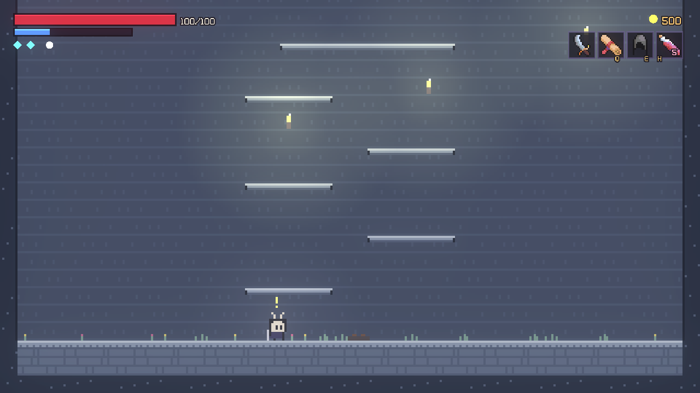

# NEWGAME — protótipo (Godot 4.7)

Arcade de stages procedural em pixel art: movimento estilo **Celeste** + combate estilo **Katana Zero**,
mundo gerado por seed (estilo Dead Cells), metroidvania, NPCs com afinidade/casamento, reputação e o Cerco final.

## Como abrir e jogar
1. Baixe o projeto: no GitHub, repositório `coaura-dot/NewGame`, branch **`claude/arcade-stages-procedural-939gyg`** → botão **Code → Download ZIP** (ou `git clone -b claude/arcade-stages-procedural-939gyg <url>`).
2. Godot não precisa instalar: extraia o zip do Godot 4.7 (ou 4.4+) em `C:\Users\igo\Downloads\godot` e rode o `.exe`.
3. No Project Manager: **Import** → selecione o `project.godot` desta pasta → **Import & Edit** → aperte **F5**.
4. No menu: **Treino** (fase fixa com todas as habilidades/armas/magias liberadas), **Arena de chefes** ou **Novo jogo** (mapa-múndi por seed).

## Controles (teclado)
| Ação | Tecla | Ação | Tecla |
|---|---|---|---|
| Mover | A/D ou setas | Pular | Espaço / C |
| Dash (8 direções) | Shift / X | Ataque leve | J / mouse esq. |
| Pesado (segure p/ carregar) | K / mouse dir. | Aparar/Bloquear | L / F |
| Esquiva | Ctrl / V | Magias | Q / E |
| Sigilo (segure e desenhe com o mouse) | R / mouse meio | Poção | H |
| Trocar arma | G | Interagir | W / ↑ / Enter |
| Pausa (equipamento/opções) | Esc | | |

Técnicas: baixo+ataque no ar = **pogo** (recarrega dash); pulo durante dash no chão = **super/hyper**; aparo perfeito = câmera lenta + crítico; baixo+pesado no ar = **Queda Esmagadora**.

## Sessão 3 — câmera, salas, golpes, música, loja e chefes

- **Câmera por sala (Celeste)**: cada sala tem o tamanho da tela; a câmera fica travada nela e desliza ao trocar de sala. Ao subir pela saída de cima o pulo é renovado (impulso de transição, como no Celeste).
- **HUD compacto no topo** (vida/foco/dash à esquerda; brasas, arma, magias e poção à direita), que fica translúcido quando o personagem passa por baixo.
- **Salas recalibradas** para o herói de 12 px: relevo com degraus de até 3 tiles, fossos, tetos irregulares, plataformas em camadas. Um validador (`scripts/level/room_reach.gd`) **simula a física real do jogador** e os testes garantem que toda saída leva a toda outra.
- **Golpes animados**: a arma aparece e gira (preparação → corte → volta) com formato por classe; inimigos também, o que telegrafa os ataques. Arco de corte limpo, sem halo. Squash no alvo atingido.
- **Música**: 11 trilhas chiptune geradas por código (`tools/build_music.py`), com crossfade por bioma, vila, chefe, mundo paralelo e Cerco.
- **Loja, forja e estudo**: fale com mercador/ferreira/sábio/curandeira nos hubs — comprar (estoque do dia), vender, forjar armas (+12% por nível) e armaduras, estudar magias, curar. Upgrades custam brasas + Fragmentos Rúnicos (baús).
- **3 chefes novos**: Duelista Sombrio (1v1, postura azul de contra-ataque), Mãe da Ninhada (horda com escudo) e Colosso de Pedra (gigante com ondas de choque e chuva de pedras). Cada faixa do mundo recebe um chefe diferente.
- **Arena de chefes** no menu principal para lutar direto contra qualquer chefe.
- Correções: mapa-múndi aparecia vazio; fonte mostrava "ReputaÇÃo" (`tools/fix_font_accents.py`); raios de luz pontilhados (agora desligados por padrão); golpe para cima e estocadas verticais desenhados de lado; NPCs com nomes repetidos.

## Sessão 2 — novo visual e feel
- **Resolução interna 320×180** (igual Celeste): o mundo é renderizado num SubViewport pixel-perfeito e escalado para a janela; HUD e menus ficam nítidos por cima.
- **Tiles de 8 px** limpos e chapados (`tools/build_tiles.py`), fundo procedural simples, pouca partícula, sem granulação/vinheta/aberração por padrão.
- **Personagem ~12 px**: criaturinha minimalista desenhada em código (`scripts/fx/creature_sprite.gd`) — pisca, olha para onde vai, estica/amassa ao pular/cair, capa balança e mostra emoções sobre a cabeça: `!` (perigo/aparo perfeito), `?` (segredo perto), `…` (parado), gota (pouca vida), `♥` (NPC querido), `♪` (ritmo), `zZ` (descansando). Inimigos e NPCs usam o mesmo estilo (aparência em `data/enemies.json` → `look`).
- **Física de Celeste** com os números nativos (corrida 90, pulo 115, dash 240/0.15s...).
- **Combate estilo Hollow Knight**: golpes curtos e rápidos (lado/cima/baixo com pogo), recuo ao acertar; escalas em `AttackRunner` (BOX/LUNGE/KB/tempos).

## O que já existe (relatório da sessão 1)
- **Movimento** (`scripts/actors/player.gd`): aceleração/inércia, coyote time, buffer de pulo, pulo variável, meia gravidade no ápice, correção de quina, dash 8-dir com super/hyper, deslizar/saltar/escalar parede, pulo duplo, queda esmagadora, plataformas one-way, gravidade invertida (dimensão Espelho).
- **Combate** (compartilhado por jogador e inimigos): 11 classes de arma com frame data em `data/weapon_classes.json` (espada fina, longa, pesada, katana, adagas, katanas duplas, odachi, faca, bastão, lâmina de sangramento, espada+escudo, manoplas); combos, pesado carregado, ataque em dash, ataques aéreos, multi-hit, ritmo (Compasso), costas, ponto fraco, aparar (rebate projéteis), bloqueio, esquiva perfeita, hitstop, tremor, status (queimar, sangrar→hemorragia, frio→congelar, choque, molhado, cegueira, atordoar, marca).
- **Magias** (`data/spells.json`, 24): fogo, gelo, arcano, terra, água, raio em cadeia, poço gravitacional, buraco negro, cegueira, teleporte, luz, psíquico, parar/desacelerar o tempo, pressão, telecinese, eco quântico, retorno no tempo + **sigilos desenhados com o mouse** (dano escala com a precisão).
- **Balanceamento**: `scripts/core/power_budget.gd` pontua armas/magias/loadouts por tier; os testes falham se algo ficar desproporcional.
- **Relíquias combináveis** (`data/buffs.json`), **armaduras em conjuntos** com bônus 2/4/6 peças e afixos aleatórios (`data/armor.json`).
- **Inimigos** (`data/enemies.json`): esqueleto, cão infernal, gato, espectro, lampadário, crânio flamejante, besta, corcel do pesadelo (elite) e Arquidemônio (chefe com 3 fases, ponto fraco, drop exclusivo e reconjuração por item). Usam as mesmas armas/magias do jogador e dropam o que usam.
- **Mundo macro** (`scripts/world/world_generator.gd`): grafo por seed, 3 camadas (céu/superfície/subterrâneo), 15 biomas, hubs, gates de habilidade sempre resolvíveis, regiões opcionais, fendas para 5 dimensões paralelas com física/regras próprias (`data/dimensions.json`). Mapa 3D pixelado com viagem rápida.
- **Fases micro** (`scripts/level/`): salas de templates ASCII (`data/rooms/core.txt`, editáveis à mão) + sintetizador procedural para qualquer combinação de saídas; combate, plataforma, desafio "caminho da dor", puzzle com alavanca, tesouro, segredo atrás de parede quebrável, salas seladas por chave/habilidade, hub, arena de chefe.
- **Social** (`scripts/social/social_system.gd`): NPCs por hub (culturas, papéis, gostos), afinidade/corações, presentes, casamento, resgate em combate, reputação baixa (mercenário/assassino) x alta (missões do rei), e **o Cerco**: escolher uma região e perder todas as outras.
- **Visual**: luzes 2D com sombras, bloom HDR, raios de luz (janelas + screen-space), motion blur, aberração cromática, gradação por dimensão, rastros, partículas de clima — tudo desligável em Opções > Vídeo. Modo assistência (velocidade, dash infinito, invencível).
- **Assets**: personagens/tiles agora procedurais; ícones, fontes e sons são placeholders CC0 (ver `assets/CREDITS.md`).

## Testes
`godot --headless --path . res://tests/test_runner.tscn` — ~4300 verificações (dados, balanceamento, mundo, fases, **alcançabilidade das salas com a física do jogador**, combate, sigilos, inventário, social, loja/forja, chefes, save, e um teste que joga a fase de treino com entradas simuladas).
Screenshots de vários cenários (salas, menu, pausa, mapa, golpes, loja, chefes): `godot --path . res://tests/shots.tscn -- <pasta> [all|rooms|region|menu|pause|map|combat|shop|bosses]`.

## Pendências conhecidas (próxima sessão)
- Ajustar o *feel* jogando de verdade (números no topo de `player.gd`, escalas em `attack_runner.gd`, IA dos chefes em `enemy.gd`).
- Mais inimigos por bioma e criaturas exclusivas dos mundos paralelos; chefes de puzzle e de parkour.
- Mais templates de sala por bioma; puzzles de verdade.
- Arte final desenhada à mão (o visual atual é procedural e fácil de trocar).
